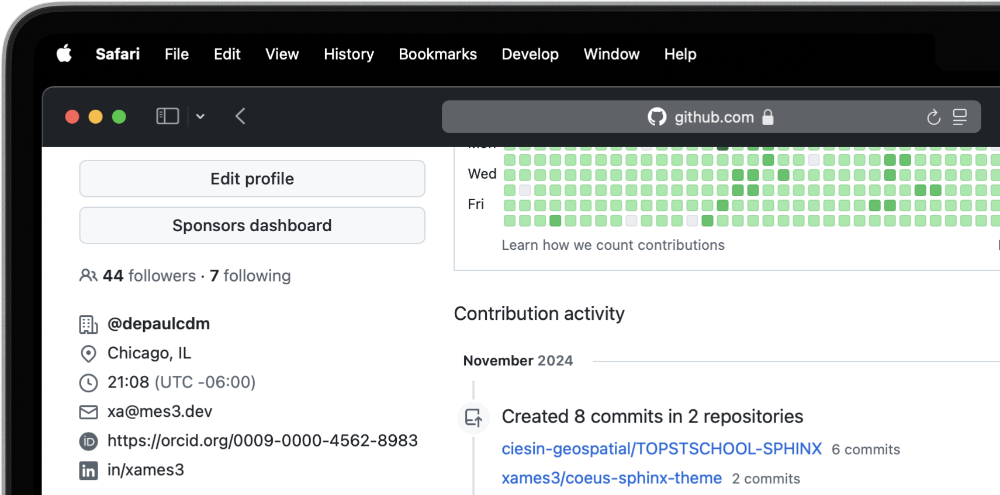

.. Author: Akshay Mestry <xa@mes3.dev>
.. Created on: Saturday, November 02, 2024
.. Last updated on: Friday, November 08, 2024

:og:title: Must Have Accounts
:og:description: Setting up all the necessary accounts for Open Science.

.. _must-have-accounts:

===============================================================================
Must Have Accounts
===============================================================================

.. title-hero::
    :icon: fa-brands fa-github
    :summary:
        Set up essential accounts needed to contribute to Open Science. Follow
        these easy, step-by-step guides to create and configure the accounts
        required for contributing towards open science.

.. tags:: getting-started, open-science-101, github, orcid, nasa-earthdata,
    zenodo

.. contributors::
    :location: Chicago, IL
    :timestamp: November 06, 2024

    - :name: Akshay Mestry
    - :email: xa@mes3.dev
    - :headshot: https://avatars.githubusercontent.com/u/90549089?v=4
    - :github: https://github.com/xames3
    - :linkedin: https://linkedin.com/in/xames3
    - :orcid: https://orcid.org/0009-0000-4562-8983
    - :status: Open Source Maintainer

In the world of open science, certain digital tools and platforms are
indispensable for sharing research, collaborating with peers, and managing
your scientific identity. Before diving into your open science journey,
setting up accounts on some key platforms will empower you to fully
participate in this transparent, collaborative ecosystem. Below, we'll walk
through the importance of each account, real-world use cases, and practical
examples of how they are utilized in open science workflows.

.. _about-github:

-------------------------------------------------------------------------------
GitHub
-------------------------------------------------------------------------------

.. image:: https://github.blog/wp-content/uploads/2023/10/
   Collaboration-DarkMode-2.png?w=1200
    :alt: GitHub banner

:term:`GitHub` is one of the most powerful tools in the world of collaborative
research, open science, and software development. It's more than just a
platform for storing code |html-dash| it's a vibrant community where you can
contribute to projects, share data, and collaborate with fellow researchers
from all over the world. Whether you're a beginner or a seasoned coder, GitHub
provides the tools you need to manage projects, contribute to
:term:`Open Science`, and share your findings.

.. dropdown:: Importance for Open Science

    - **Version Control.** Keeps track of all changes to your code, making it
      easy to revert to previous versions if necessary. This is crucial in
      research projects where :term:`reproducibility` is key.

    - **Collaborative Research.** Enables multiple researchers to work
      together on the same project, with features like forking, pull requests,
      and issue tracking. For instance, a team of climate scientists may use
      GitHub to manage code for analyzing climate models. Each team member
      contributes code and reviews changes through pull requests.

    - **Open Access.** You can make your repositories public, allowing others
      to view, use, and contribute to your research. Example for this would be
      an ecologist sharing a Python package on GitHub that automates the
      analysis of satellite imagery, allowing others to replicate or build on
      the work.

At its core, GitHub is a hosting service for version control using Git. This
means it helps you track changes in your work, collaborate with others
seamlessly, and manage multiple versions of a project. Many of NASA's open
science projects, including the :term:`TOPS` :term:`SCHOOL` initiative, use
GitHub to share their work and invite contributions from the global community.
So, setting up a GitHub account is the first step toward being part of this
exciting, inclusive movement.

Let's walk through how to create your personal GitHub account and get started
with open science!

.. note::

    If you already have a GitHub account, you can skip this guide and checkout
    things to do to :ref:`securing-your-github-account` below.

.. _creating-github-account:

Creating GitHub Account
===============================================================================

#. Go to `GitHub`_.
#. In the upper-right corner of the page, click on the **Sign up** button to
   start creating your personal account. GitHub will guide you through the
   process, one step at a time.
#. You will be asked for a **username**, **email address**, and to create a
   **password**.
#. Once you've entered your details, :term:`GitHub` will send a verification
   email to the address you provided.
#. Check your inbox (and your spam folder if you don't see it) and click the
   link to verify your email address.
#. Without verifying your email, you won't be able to perform certain tasks
   like creating repositories, so this step is important!
#. You'll be asked to complete a simple CAPTCHA (a quick task to confirm
   you're not a robot). Just follow the instructions, and you're good to go.
#. GitHub will prompt you to choose a plan. For most users just starting with
   :term:`Open Science`, the **Free** plan is more than enough. You can always
   upgrade later if you need advanced features like private repositories, but
   for now, you're all set with the free option!
#. Once your account is set up, you'll land on your GitHub dashboard. This is
   your home base for creating projects, exploring repositories, and
   contributing to open science. GitHub offers a helpful tutorial called
   "`Hello World <https://docs.github.com/en/get-started/start-your-journey/
   hello-world>`_" to get you started with the basics |html-dash| like
   creating your first repository, etc.

.. image:: https://octodex.github.com/images/NUX_Octodex.gif
    :align: center
    :alt: GitHub Octocat
    :class: transparent-border
    :width: 500

But before you move on, take a moment to congratulate yourself. You've just
taken a significant step toward being part of the open science community!

.. _securing-your-github-account:

Securing Your GitHub Account
===============================================================================

GitHub is an integral platform for collaborative research and open-source
projects, but with this openness comes the need for robust security measures.
By following best practices, you can ensure your research and data are
protected against unauthorized access. As of March 2023, GitHub required all
users who contribute code on `GitHub`_ to enable one or more forms of
two-factor authentication (2FA). Here's a detailed guide on securing your
GitHub account. All the security settings are accessible using the same steps.

- Navigate to Security Settings by clicking on to your
  :menuselection:`Profile --> Settings --> Password and authentication`

.. carousel::
    :show_controls:
    :show_fade:

    .. image:: ../../../_assets/guides/github-secure-profile.png
        :alt: Navigate to your profile - GitHub
        :class: transparent-border no-rounded-corners

    .. image:: ../../../_assets/guides/github-secure-settings.png
        :alt: Select Settings - GitHub
        :class: transparent-border no-rounded-corners

    .. image:: ../../../_assets/guides/github-secure-password.png
        :alt: Choose Password and authentication - GitHub
        :class: transparent-border no-rounded-corners

.. tab-set::

    .. tab-item:: Two-factor Authentication (2FA)

        We strongly recommend that you configure 2FA for your account. 2FA is
        an extra layer of security that can help keep your account secure.
        Two-factor Authentication (2FA) adds an extra layer of security to
        your GitHub account by requiring a second form of verification beyond
        just your password. Here's how to set it up:

        .. image:: ../../../_assets/guides/github-secure-2fa.png
            :align: center
            :alt: Two-factor authentication - GitHub
            :scale: 60

        - Under the "Two-factor authentication" section, click the button to
          begin the setup process. Choose your authentication method
          :term:`GitHub` offers several 2FA options [#]_.
        - Follow the setup instructions and remaining prompts to complete the
          2FA setup. Ensure you test the 2FA method to confirm it's working
          properly.

    .. tab-item:: Adding a Passkey

        You can add passkeys to your account so that you can sign in safely
        and easily, without requiring a password and two-factor
        authentication. You can also use passkeys when performing a sensitive
        action (sudo mode), or to authenticate a password reset.

        Passkeys allow you to sign in securely to GitHub in your browser
        without having to input your password. If you use two-factor
        authentication (2FA), passkeys satisfy both password and 2FA
        requirements, so you can complete your sign in with a single step. If
        you don't use 2FA, using a passkey will skip the requirement to verify
        a new device via email. You can also use passkeys for sudo mode and
        resetting your password.

        Passkeys are pairs of cryptographic keys (a public key and a private
        key) that are stored by an authenticator you control. The
        authenticator can prove that a user is present and is authorized to
        use the passkey.

        .. image:: ../../../_assets/guides/github-secure-passkeys.png
            :align: center
            :alt: Passkeys - GitHub
            :scale: 60

        - Under the "Passkeys" section, click the button which says "Add a
          passkey" to begin the a process.
        - Follow the setup instructions and remaining prompts to complete the
          setup. [#]_ At the prompt, follow the steps outlined by the passkey provider.
        - On the next page, review the information confirming that a passkey
          was successfully registered, then click Done.

    .. tab-item:: Connect with SSH |badge-new|

            You can access and write data in repositories on GitHub using SSH
            (Secure Shell Protocol). When you connect via SSH, you
            authenticate using a private key file on your local machine. When
            you set up SSH, you will need to generate a new private SSH key
            and add it to the SSH agent. You must also add the public SSH key
            to your account on GitHub before you use the key to authenticate
            or sign commits.

            `Learn more <https://docs.github.com/en/authentication/connecting
            -to-github-with-ssh/generating-a-new-ssh-key-and-adding-it-to
            -the-ssh-agent>`_ |chevron-right|

            .. tip::

                Using the SSH protocol, you can connect and authenticate to
                remote servers and services. With SSH keys, you can connect to
                GitHub without supplying your username and personal access
                token at each visit. You can also use an SSH key to sign
                commits.

.. _about-orcid:

-------------------------------------------------------------------------------
ORCID
-------------------------------------------------------------------------------

Next, you'll learn how to create your :term:`ORCID` account, an important step
to ensure that your research and contributions are easily identifiable and
accessible in the Open Science community. Don't worry if this is your first
time doing this |html-dash| the process is straightforward, and this guide will help you through each step. Before we dive into the steps, let's talk
about why having an ORCID account is important.

:term:`ORCID` provides a unique, persistent identifier for researchers,
ensuring that your contributions are correctly attributed to you, regardless
of any changes :term:`Open Science`, where collaboration and transparency are
key. Your ORCID profile becomes your digital fingerprint in the world of
research, linking your work to your name in a global, accessible database.

.. _creating-orcid-account:

Creating ORCID Account
===============================================================================

#. Go to `ORCID`_.
#. You'll see a form asking for some basic information. No worries, this will
   only take a minute or two. Enter your information like your **first** and
   **last** name, **primary email address** (this is where all your
   notifications will be sent), possibly a **secondary email address**
   (optional but recommended, to ensure you don't lose access in case you
   forget your credentials).
#. Next would be the password, make sure your password is something
   memorable but secure. Instructions about the password requirements would be
   mentioned while entering the password.
#. Before you complete the registration, you'll need to agree to ORCID's terms.
   These are pretty straightforward and ensure that your data is used
   responsibly.
#. Now that your account is created, ORCID will send a verification email to
   primary email address you provided. It's important to verify your email to
   complete the setup. Check your inbox (and your spam folder if you don't see
   it) and click the link to verify your email address.

.. tip::

    Set your visibility preferences. :term:`ORCID` gives you control over the
    privacy of your information. You can set your profile to be:

    - **Everyone.** Anyone can see your information.
    - **Trusted parties.** Only trusted parties (like your institution) can
      view your profile.
    - **Only me.** Only you can see your information.

    It is best to keep it **Everyone** to maximize visibility for your work in
    :term:`Open Science`, but you can always change it later.

.. _customizing-orcid-account:

Make the Most of Your ORCID Account
===============================================================================

Now that you've created and set up your ORCID account, you're ready to start
using your :term:`ORCID` ID in your research. Include it in your **CV**,
**Research papers**, **Articles**, **Conference presentations** and **Grant
applications**. This unique identifier will ensure that all your work is
properly attributed to you, wherever it's shared.

Personalizing your ORCID account is crucial in making sure your ORCID profile
represents you well. The more information you provide, the easier it will be
for collaborators and institutions to find you and recognize your work. ORCID
supports integration with various platforms, including :term:`GitHub` and
LinkedIn. You can link your ORCID profile to your GitHub account to create a
cohesive professional identity across platforms.

    ORCID integrated with GitHub account.

Your ORCID profile is a living document. As your career progresses, be sure to
keep it updated with your latest contributions, projects, and affiliations.
This is especially important in :term:`Open Science`, where collaboration and
visibility are key. Set a reminder to check and update your profile every few
months. That way, your information stays fresh and accurate.

With your ORCID account ready, you're now one step closer to engaging fully
with the Open Science community. Remember, :term:`Open Science` is all about
transparency, accessibility, and collaboration. By taking the time to set up
your ORCID account, you're contributing to a global movement dedicated to
making science open to all.

.. _about-zenodo:

-------------------------------------------------------------------------------
Zenodo
-------------------------------------------------------------------------------

.. image:: https://upload.wikimedia.org/wikipedia/commons/thumb/e/e8/
    Zenodo-gradient-square.svg/1200px-Zenodo-gradient-square.svg.png
    :alt: Zenodo banner

Zenodo is a versatile, :term:`open access` :term:`data repository` developed
under the European OpenAIRE program and operated by CERN. Launched to support
the open science movement, Zenodo provides a platform for researchers to
share, publish, and archive a wide variety of research outputs, including
datasets, software, publications, and multimedia. It is an indispensable tool
for scientists committed to the principles of open science, ensuring that
their work is easily findable, accessible, citable, and reusable.

.. dropdown:: Importance in Open Science

    - **Long-Term Preservation and Accessibility.** Zenodo ensures that
      research outputs are archived securely and remain accessible over the
      long term. By partnering with CERN, a world leader in data preservation,
      Zenodo offers robust infrastructure that guarantees your work will not
      be lost or forgotten.
    - **DOIs for Every Output.** One of Zenodo's most powerful features is its
      ability to assign DOIs (Digital Object Identifiers) to all research
      outputs. This feature gives your work a permanent, citable reference,
      ensuring that you receive proper credit and recognition.
    - **Supporting Transparency and Reproducibility.** Zenodo ensures that
      research outputs are openly available and reproducible. By archiving
      data and software with detailed :term:`metadata` and :term:`licensing`
      information, researchers make it easier for others to validate findings
      and build upon existing work.
    - **Integration with GitHub.** Zenodo integrates seamlessly with GitHub, a
      popular platform for hosting code and collaborating on software
      projects. Researchers can set up Zenodo to automatically archive GitHub
      repositories, creating versioned DOIs for each software release.

Zenodo plays a crucial role in the scientific ecosystem by offering free and
secure data hosting while also assigning Digital Object Identifiers (DOIs) to
ensure research outputs are properly credited and remain citable. Zenodo is a
popular choice for publishing datasets in a citable format. Researchers can
upload large datasets, organize them with detailed metadata, and share them
with a DOI that ensures proper citation and credit. Software is an
increasingly important part of research, and Zenodo provides a reliable way to
share and cite code. Researchers can link their :term:`GitHub` repositories
and create DOIs for specific releases.

.. _creating-zenodo-account:

Creating Zenodo Account
===============================================================================

Creating a Zenodo account is super simple if you already have a GitHub or an
ORCID account. If not already, checkout :ref:`creating-github-account` or
:ref:`creating-orcid-account`.

#. Go to `Zenodo`_.
#. Click on Sign up. Here, you can choose to either sign up with your
   information by providing them or you can link your GitHub or ORCID accounts.
   If you choose the former, fill in the necessary details like your
   **username**, **full name**, **affiliations**, **email** and a **password**.
#. Once everything is entered, simply click Sign Up.

.. _customizing-zenodo-account:

Integrating with GitHub and ORCID
===============================================================================

Now that you've created and set up your Zenodo account, you're ready to link it
with GitHub and ORCID. Follow the on screen instructions and integrate your
respective accounts. The complete integration would look something like below:

.. carousel::
    :show_controls:
    :show_fade:

    .. image:: ../../../_assets/guides/zenodo-choose-profile.png
        :alt: Navigate to your profile - Zenodo
        :class: transparent-border no-rounded-corners

    .. image:: ../../../_assets/guides/zenodo-link-accounts.png
        :alt: Link Accounts - Zenodo
        :class: transparent-border no-rounded-corners

    .. image:: ../../../_assets/guides/zenodo-link-all.png
        :alt: Linked Accounts (GitHub, ORCID and OpenAIRE) - Zenodo
        :class: transparent-border no-rounded-corners

.. _about-nasa-earthdata:

-------------------------------------------------------------------------------
NASA EarthData
-------------------------------------------------------------------------------

:term:`NASA` `EarthData`_ is a web-based system that provides global access to
Earth science data from NASA's Earth Observing System Data and Information
System (EOSDIS [#]_). EOSDIS manages, stores, and distributes a vast array of
Earth science data gathered from NASA's Earth Observing satellites and field
measurement programs. These datasets encompass critical variables like
atmospheric composition, oceanography, land cover, climate, natural disasters,
and more.

.. dropdown:: Importance in Open Science

    NASA EarthData embodies the principles of open science by offering free,
    unrestricted access to data that is crucial for understanding our planet.
    In line with the :term:`FAIR` principles |html-dash| **Findable**,
    **Accessible**, **Interoperable**, and **Reusable** |html-dash| NASA
    EarthData makes complex scientific information available in a way that
    fosters :term:`transparency`, :term:`reproducibility`, and
    :term:`collaborative research`.

    - **Promoting Transparency and Reproducibility.** By providing
      unrestricted access to high-quality environmental data, NASA EarthData
      ensures that research findings are reproducible and verifiable.
      Scientists from anywhere in the world can use the same datasets, run
      their own analyses, and compare results, which strengthens the
      credibility of scientific research.
    - **Enabling Interdisciplinary Collaboration.** Environmental challenges,
      such as climate change, require input from multiple scientific
      disciplines. NASA EarthData facilitates this by offering diverse
      datasets that can be used across fields like meteorology, ecology,
      sociology, and economics. This fosters a spirit of collaboration and
      cross-pollination of ideas.
    - **Supporting Global Efforts to Tackle Environmental Issues.** From
      climate change to disaster management, NASA `EarthData`_ provides
      critical insights that inform global efforts to protect the planet. Open
      access to this data empowers not just scientists but also policymakers,
      educators, and activists working toward environmental sustainability.

Researchers, scientists, policymakers, and educators worldwide use NASA
EarthData to address pressing scientific questions and societal challenges. For researchers working with Earth science data, NASA EarthData provides
access to extensive datasets.

.. tab-set::

    .. tab-item:: Use cases

        - **Climate Change Research.** NASA `EarthData`_ provides researchers
          with critical information on global temperature patterns, ice sheet
          dynamics, sea level rise, and carbon dioxide concentrations. Using
          this data, climate scientists can model future scenarios and develop
          strategies to mitigate climate change effects.
        - **Natural Disaster Monitoring and Response.** NASA EarthData plays a
          pivotal role in disaster management by offering near-real-time data
          on hurricanes, wildfires [#]_, earthquakes [#]_, and other natural
          disasters. [#]_ This data is crucial for tracking the progression of
          a disaster and coordinating response efforts.
        - **Environmental Justice and Health Research.** Researchers and
          policy makers use NASA `EarthData`_ to study the environmental
          factors affecting human health, such as air quality [#]_ and water
          contamination. [#]_ This data helps identify regions
          disproportionately affected by pollution and guides efforts toward
          achieving environmental justice. [#]_
        - **Agriculture, Water Resource Management and Food Security.**
          Agricultural scientists use data from NASA EarthData to monitor crop
          health, predict yields, and understand the impacts of drought and
          other climate-related factors. This information is essential for
          ensuring food security in vulnerable regions.

    .. tab-item:: Why is it so important?

        - **Global Access to Critical Environmental Data.** NASA EarthData
          democratizes access to some of the most comprehensive Earth science
          datasets available. With data spanning decades, it provides a
          historical perspective that can help researchers analyze trends and
          patterns over time. This kind of data is critical for climate
          studies, disaster management, and environmental monitoring.
        - **High-Quality and Reliable Data.** All data hosted on NASA
          `EarthData`_ is meticulously curated and validated, making it highly
          reliable for research and analysis. These datasets come from
          state-of-the-art satellite missions and are updated frequently,
          providing researchers with up-to-date information on global
          environmental changes.
        - **Supporting Scientific Collaboration.** :term:`Open Access` to NASA
          EarthData encourages collaboration among scientists across different
          disciplines and geographic locations. For example, a climate
          scientist studying global warming in the Arctic can share insights
          and data with an agricultural researcher investigating crop impacts
          in Asia. This interdisciplinary collaboration fosters a holistic
          understanding of Earth's interconnected systems.

.. _creating-nasa-earthdata-account:

Creating EarthData Account
===============================================================================

#. Go to `EarthData`_.
#. Click on Register. Like ORCID, you'll see a form asking for some basic
   information. Enter your information like your **username** and **password**.
   Confirm the password once. Instructions about the password requirements
   would be mentioned while entering the password.
#. Next would be the **first** and **last name**, **primary email address**,
   your **Country of Research** and **Affiliations**.
#. Review and accept the EarthData terms of use and privacy policy.
#. Finally, Click the :guilabel:`&Register For EarthData Login` button to
   complete the form submission.

-------------------------------------------------------------------------------
Up Next
-------------------------------------------------------------------------------

Congratulations!

You've now successfully set up some of the most critical
accounts that will empower your journey in open science. These platforms will
serve as your foundation, enabling you to share, collaborate, and publish
research data while adhering to the highest standards of openness and
accessibility. These accounts were your first steps into the open science
landscape, and each one is an important piece of the puzzle. Whether you're
archiving your research, sharing datasets, or managing your scholarly
identity, you're now equipped to participate in a global community dedicated
to transparency, reproducibility, and collaboration.

With your foundational accounts established, it's time to gear up with the
tools that will make your open science experience efficient and effective. In
the next section, we'll explore the essential software and platforms you'll
need. This upcoming guide will walk you through the necessary tools, explain
its significance, and provide detailed instructions on setting them up and
using them effectively. We'll also cover best practices to enhance your
workflow and collaborate with other researchers around the world.

.. grid:: 2 2 2 2

    .. grid-item::

        .. card:: Tools to empower your Open Science workflows
            :img-alt: Tools setup guide
            :img-background: ../../../_assets/guides/tools-technologies.png
            :link-type: doc
            :link: tools-technologies
            :shadow: none

.. rubric:: References
    :heading-level: 2

.. [#] Learn more about various ways of `Configuring two-factor authentication
       <https://docs.github.com/en/authentication/securing-your-account-with
       -two-factor-authentication-2fa/configuring-two-factor-authentication>`_.
.. [#] Learn more about `Adding a passkey to your account <https://docs.github.
       com/en/authentication/authenticating-with-a-passkey/managing-your
       -passkeys#adding-a-passkey-to-your-account>`_.
.. [#] Earth Observing System Data Information System (EOSDIS)
       `case studies <https://appel.nasa.gov/critical-knowledge/case-studies/
       appel-case-studies/eosdis-html/>`_.
.. [#] NASA's `wildfire data <https://www.earthdata.nasa.gov/topics/human
       -dimensions/wildfires>`_ enable users to monitor conditions before a
       fire starts, track them once they do, and assess their effects after a
       burn.
.. [#] NASA's `earthquake data <https://www.earthdata.nasa.gov/topics/solid
       -earth/earthquakes>`_ help researchers understand the land surface
       deformation, health risks, and economic impacts caused by these
       disasters.
.. [#] Natural Hazards, a topic on the NASA EarthData `forum <https://www.
       earthdata.nasa.gov/topics/human-dimensions/natural-hazards>`_.
.. [#] NASA's `air quality data <https://www.earthdata.nasa.gov/topics/
       atmosphere/air-quality>`_ allow users to measure pollutants in the
       atmosphere and track their health and socioeconomic impact on people.
.. [#] Diseases caused by consuming water that contains harmful
       microorganisms, biotoxins, or toxic contaminants. Examples include
       cholera, schistosomiasis, and other gastrointestinal problems.
       `Waterborne diseases <https://www.earthdata.nasa.gov/topics/human
       -dimensions/waterborne-diseases>`_ are often the result of unsafe
       sanitation practices or a breakdown in infrastructure that can be a
       result of or exacerbated by various natural hazards, such as flood or
       drought.
.. [#] NASA's `Earth-observing and socioeconomic data <https://www.earthdata.
       nasa.gov/topics/human-dimensions/environmental-justice>`_ offers
       researchers the ability to identify environmental issues
       disproportionally harming communities.
