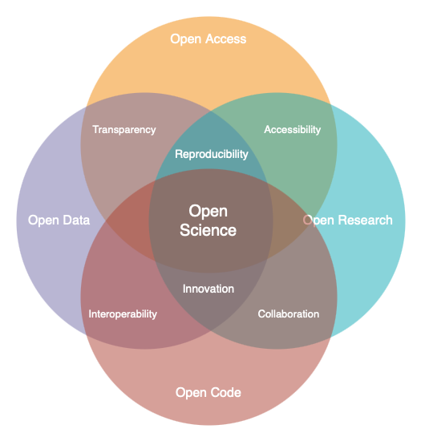

.. Author: Akshay Mestry <xa@mes3.dev>
.. Created on: Friday, November 01, 2024
.. Last updated on: Friday, November 01, 2024

.. _open-science-101:

===============================================================================
Open Science 101
===============================================================================

.. title-hero::
    :icon: fa-regular fa-arrows-spin
    :summary:
        Discover the transformative world of Open Science and learn how
        SCHOOL program is empowering researchers and learners to contribute to
        global challenges through open science.

.. tags:: getting-started, open-science-101

.. contributors::
    :location: Chicago, IL
    :timestamp: November 01, 2024

    - :name: Akshay Mestry
    - :email: xa@mes3.dev
    - :headshot: https://avatars.githubusercontent.com/u/90549089?v=4
    - :github: https://github.com/xames3
    - :linkedin: https://linkedin.com/in/xames3
    - :orcid: https://orcid.org/0009-0000-4562-8983

:term:`Open Science` is a global movement that aims to make scientific
research more accessible, transparent, and collaborative. At :term:`NASA`,
we're embracing this transformation through our :term:`TOPS` [#]_ initiative,
which seeks to democratize scientific knowledge and empower individuals from
all walks of life to engage with and contribute to the research process.
:term:`Open Science` is not just a set of practices; it's a movement that
seeks to revolutionize the way research is conducted and shared across the
globe. At its heart, open science aims to make scientific research more
transparent, accessible, and collaborative. By embracing open science,
researchers can accelerate discoveries, increase public engagement, and ensure
that science serves humanity more effectively.

The :term:`SCHOOL`, **Science Core Heuristics for Open Science Outcomes in
Learning** program is an essential part of NASA's TOPS initiative. It provides
a structured, immersive curriculum designed to introduce students,
researchers, and science enthusiasts to the core principles of Open Science.
Whether you're just starting out or already well-versed in scientific
research, our mission is to help you harness the power of Open Science to
drive meaningful change.

-------------------------------------------------------------------------------
What is Open Science?
-------------------------------------------------------------------------------

At its core, Open Science seeks to remove the barriers traditionally
associated with scientific research. In contrast to conventional research
models |html-dash| where data, methodologies, and findings are often limited
to a select few, Open Science promotes the idea that all aspects of the
research process should be openly shared and accessible to everyone.

.. dropdown:: Openness means...

    - **Sharing Data.** Making raw data available for others to use, analyze,
      and build upon.

    - **Transparent Methods.** Sharing methodologies, tools, and software
      openly to enhance reproducibility.

    - **Open Access.** Providing access to scientific publications and research
      outputs to ensure that knowledge reaches a wider audience.

:term:`Open Science` promotes transparency, encourages collaboration, and
accelerates scientific discovery by allowing others to replicate studies,
validate results, and build upon previous work. By adopting Open Science
principles, the research community can collectively tackle the world's most
pressing challenges |html-dash| from climate change and environmental
degradation to public health crises and social inequalities.

    Venn diagram, created using draw.io [#]_, illustrates the four pillars of
    Open Science |html-dash| Open Access, Open Research, Open Code, and Open
    Data. These interconnected principles promote transparency,
    collaboration, and accessibility in research, fostering a more trustworthy
    and inclusive scientific community.

To put things
simply, Open science is an umbrella term that encompasses various practices
aimed at making research more **transparent** and **accessible**. It covers
the entire research lifecycle, from data collection to publishing findings,
emphasizing openness and collaboration. You already might be doing open science
unknowningly if you are:

- Sharing research protocols openly or documenting code used for data analysis.
- Publishing in open-access journals or sharing preprints of research articles.
- Sharing raw datasets and detailed analysis scripts.

-------------------------------------------------------------------------------
Why Open Science Matters?
-------------------------------------------------------------------------------

The importance of Open Science goes far beyond academia. In today's
interconnected world, scientific challenges are increasingly global and
complex. Problems like climate change, environmental justice, and natural
disasters demand cross-disciplinary solutions that involve many collaborators.
:term:`Open Science` breaks down silos, enabling diverse teams of researchers,
policymakers, and citizens to work together in solving real-world problems.

.. dropdown:: Reasons why open science is vital

    - **Transparency and Trust.** By making research processes visible and
      open to scrutiny, Open Science enhances trust in scientific findings.

    - **Collaboration Across Borders.** Open Science fosters collaboration by
      removing barriers to information sharing, allowing researchers from
      across the globe to work together seamlessly.

    - **Faster Innovation.** Open access to data and research outputs reduces
      duplication of effort, speeds up discoveries, and fosters innovation.

    - **Inclusive Knowledge.** Open Science ensures that knowledge is not
      limited to specific groups or regions, promoting equity in access to
      information and fostering a more inclusive research community.

.. dropdown:: Four key areas where open science makes a significant impact [#]_

    .. tab-set::

        .. tab-item:: Accessibility

            - **Citizen Science Initiatives and Engagement:** Open Science
              allows for greater participation from the public, enabling
              citizen scientists to contribute to research efforts and engage
              with scientific discoveries.

            - **Lifesaving Access to Medical and Scientific Information:** Open
              Science ensures that critical medical and scientific information
              is accessible to everyone, potentially saving lives by providing
              timely and accurate data.

            - **Democratization of the Scientific Process:** By making research
              accessible to all, Open Science democratizes the scientific
              process, giving everyone chance to contribute to and benefit
              from scientific advancements.

            - **Increased Earth Observation Accessibility:** Open Science
              expands access to Earth observation data, allowing more people
              to monitor and understan our planet.

        .. tab-item:: Efficiency & Innovation

            - **Cleaner, More Secure Code with More Contributors:** Open-source
              science invites a broader community to contribute to and improve
              scientific software, leading to cleaner, more secure code.

            - **Long-Term Maintenance Assistance:** The open-source model
              encourages long-term maintenance and support from the community,
              ensuring that tools and resources remain up-to-date and
              functional.

            - **New Monetized Offices and Data Centers:** Open Science can
              lead to the creation of new monetized opportunities, such as
              data centers, that support and enhance scientific research.

            - **Transparent Research Spending:** Open Science promotes
              transparency in research spending, making the allocation of funds
              more efficient and accountable.

        .. tab-item:: Reproducibility

            - **Increased Transparency of Research Results:** Open Science
              makes research results more transparent, allowing for easier
              verification and replication of studies.

            - **Reliable Results Through Confirmation:** The open sharing of
              data and methodologies enables other researchers to confirm
              findings, leading to more reliable and robust scientific
              outcomes.

            - **Reduced Pressure for "Exciting" Research:** By focusing on
              reproducibility and transparency, Open Science reduces the
              pressure to produce "exciting" results just to get published,
              fostering a more honest and rigorous scientific process.

            - **More Robust Scientific Products:** Open Science enhances the
              overall quality of scientific research, leading to more
              trustworthy and impactful results.

        .. tab-item:: Diversity & Inclusion

            - **International Accessibility:** Open Science ensures that
              scientific knowledge is accessible to researchers around the
              world, regardless of their location or resources.

            - **Breaking Down Financial Barriers:** Open Science helps to
              dismantle systemic financial barriers, allowing more people to
              participate in and benefit from scientific research.

            - **Diversity Among Researchers:** By making science more
              accessible, open science encourages greater diversity among
              researchers, leading to a richer and more inclusive scientific
              community.

            - **Equitable Distribution of Opportunity:** Open Science ensures
              that opportunities for research and collaboration are
              distributed more equitably, fostering a more inclusive and
              diverse scientific environment.

:term:`Open Science` isn't just about making research available |html-dash|
it's about making a difference. By participating in Open Science, you are
contributing to a global movement that seeks to democratize knowledge, break
down silos, and create a more equitable world. When scientists, researchers,
and learners like you come together to share knowledge openly, we amplify our
ability to solve complex problems and create a future where science benefits
everyone.

Imagine the ripple effect your contributions could have: a dataset you share
could lead to a breakthrough in environmental protection, the method you
develop could improve public health outcomes, or your insights into climate
change could help shape policies that protect vulnerable communities. Open
Science allows you to play a part in something far bigger than yourself.

The below video summarizes the importance of Open Science. [#]_

.. youtube-video:: https://www.youtube.com/watch?v=c-bemNZ-IqA

.. rubric:: References
    :heading-level: 2

.. [#] NASA launches a new `Open Science Curriculum
       <https://nasa.github.io/Transform-to-Open-Science/>`_.
.. [#] Learn more about `draw.io <https://draw.io/>`_ which is a technology
       stack for building diagramming applications.
.. [#] A wonderful blog by NASA on `Why Do Open Science?
       <https://science.nasa.gov/open-science/why-do-open-science/>`_
.. [#] Dr. Rachael Ainsworth's talk on `Research Culture is Broken; Open
       Science can Fix It <https://www.youtube.com/watch?v=c-bemNZ-IqA>`_.
