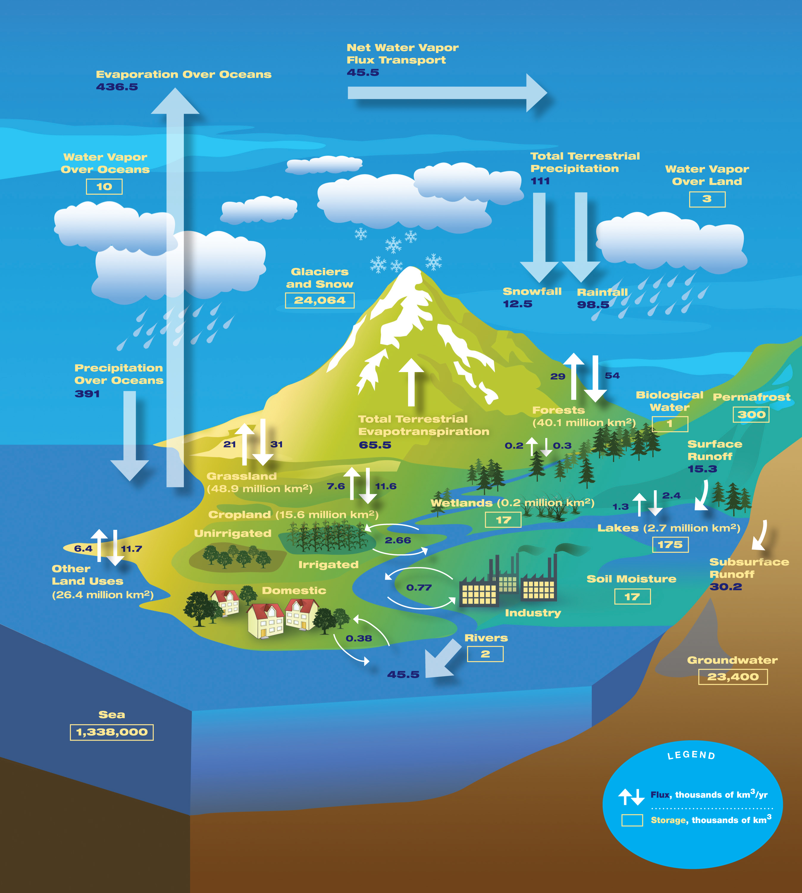

.. Author: Dhruvil Prajapatip <dprajapati@nl.edu>
.. Created on: Saturday, November 28, 2024
.. Last updated on: Sunday, November 28, 2024

:og:title: Accounts Setup
:og:description: Setting up all the necessary accounts for Open Science.

.. _water-lesson1:

=====================================================
WSIM-GLDAS: Acquisition, Exploration, and Integration
=====================================================

.. contributors::
    :timestamp: June 3, 2024
    :location: Earth

    - :name: Josh Brinks
    - :email:
    - :headshot:
    - :github:
    - :linkedin:
    - :orcid:
    - :status:

    - :name: Elaine Famutimi
    - :email:
    - :headshot:
    - :github:
    - :linkedin:
    - :status:

-----------------
Lesson 1 Overview
-----------------
In this lesson, you will acquire the dataset called Water Security Indicator Model - Global Land Data Assimilation System (WSIM-GLDAS) from the NASA Socioeconomic Data and Applications Center (SEDAC) website, perform various pre-processing tasks, and explore the dataset with advanced visualizations. We will also integrate WSIM-GLDAS with a global administrative boundary dataset called geoBoundaries and a population dataset called the Gridded Population of the World. You will learn how to perform numerous data manipulations and visualizations throughout this lesson.

Learning Objectives
-------------------
**After completing this lesson, you should be able to:**
    - Retrieve WSIM-GLDAS data from SEDAC.
    - Retrieve Administrative Boundary using the geoBoundaries API.
    - Subset WSIM-GLDAS data for a region and time period of interest.
    - Visualize geospatial data to highlight precipitation deficit patterns.
    - Write a pre-processed NetCDF-formatted file to disk.
    - Perform visual exploration with histograms, choropleths, and time series maps.
    - Integrate gridded population data with WSIM-GLDAS data to perform analyses and construct visualizations to understand how people are impacted.
    - Summarize WSIM-GLDAS and population raster data using zonal statistics.

--------------
Introduction
--------------
The water cycle is the process of circulation of water on, above, and under the Earth’s surface (NOAA 2019). Human activities produce greenhouse gas emissions, land use changes, dam and reservoir development, and groundwater extraction have affected the natural water cycle in recent decades (IPCC 2023). The influence of these human activities on the water cycle has consequential impacts on oceanic, groundwater, and land processes, influencing phenomena such as droughts and floods (Zhou 2016).

Precipitation deficits, or periods of below-average rainfall, can lead to drought, characterized by prolonged periods of little to no rainfall and resulting water shortages. Droughts often trigger environmental stresses and can create cycles of reinforcement impacting ecosystems and people (Rodgers 2023). For example, California frequently experiences drought but the combination of prolonged dry spells and sustained high temperatures prevented the replenishment of cool fresh water to the Klamath River, which led to severe water shortages in 2003 and again from 2012 to 2014. These shortages affect agricultural areas like the Central Valley, which grows almonds, one of California’s most important crops, with the state producing 80% of the world’s almonds. These severe droughts, coupled with competition for limited freshwater resources, resulted in declining populations of Chinook salmon due to heat stress and gill rot disease disrupting the food supply for Klamath basin tribal groups (Guillen 2002; Bland 2014).

The **Water Security (WSIM-GLDAS) Monthly Grids, v1 (1948 - 2014)** The Water Security (WSIM-GLDAS) Monthly Grids, v1 (1948 - 2014) dataset “identifies and characterizes surpluses and deficits of freshwater, and the parameters determining these anomalies, at monthly intervals over the period January 1948 to December 2014” (ISciences and Center For International Earth Science Information Network-CIESIN-Columbia University 2022b). The dataset can be downloaded from the NASA SEDAC website. Downloads of the WSIM-GLDAS data are organized by a combination of thematic variables (composite surplus/deficit, temperature, PETmE, runoff, soil moisture, precipitation) and integration periods (a temporal aggregation) (1, 3, 6, 12 months). Each variable-integration combination consists of a NetCDF raster (.nc) file ( with a time dimension that contains a raster layer for each of the 804 months between January, 1948 and December, 2014. Some variables also contain multiple attributes each with their own time series. Hence, this is a large file that can take a lot of time to download and may cause computer memory issues on certain systems. This is considered BIG data.

.. important::
    A raster dataset is a type of geographic data in digital image format with numerical information stored in each pixel. (Rasters are often called grids because of their regularly-shaped matrix data structure.) Rasters can store many types of information and can have dimensions that include latitude, longitude, and time. NetCDF is one format for raster data; others include Geotiff, ASCII, and many more. Several raster formats like NetCDF can store multiple raster layers, or a “raster stack,” which can be useful for storing and analyzing a series of rasters.

------------------
Acquiring the Data
------------------

For this lesson, we will work with the WSIM-GLDAS dataset Composite Anomaly Twelve-Month Return Period NetCDF file. This contains water deficit, surplus, and combined “Composite Anomaly” variables with an integration period of 12 months. Integration period represents the time period at which the anomaly values are averaged over. The 12-month integration averages water deficits (droughts), surpluses (floods), and combined (presence of droughts and floods) over a 12-month period ending with the month specified. We begin with the 12-month aggregation because this is a snapshot of anomalies for the entire year making it useful to get an understanding of a whole year; once we identify time periods of interest in the data, we can take a closer look using the 3-month or 1-month integration periods.

We’ll start by downloading the file directly from the SEDAC website. The dataset documentation describes the composite variables as key features of WSIM-GLDAS that combine “the return periods of multiple water parameters into composite indices of overall water surpluses and deficits (ISciences and Center For International Earth Science Information Network-CIESIN-Columbia University 2022a)”. The composite anomaly files present the data in terms of how often they occur; or a “return period.” For example, a deficit return period of 25 signifies a drought so severe that we would only expect it to happen once every 25 years. Please go ahead and download the file.

- First, go to the SEDAC website at https://sedac.ciesin.columbia.edu/. You can explore the website by themes, datasets, or collections. We will use the search bar at the top to search for “water security wsim”. Find and click on the Water Security (WSIM-GLDAS) Monthly Grids, v1 (1948–2014) dataset. Take a moment to review the dataset’s overview and documentation pages.
- When you’re ready, click on the Data Download tab. You will be asked to sign in using your NASA EarthData account.
- Find the Composite Class, and click on the Variable Composite Anomaly Twelve-Month Return Period.

----------------
Reading the Data
----------------

.. tab-set::

    .. tab-item:: Python Code

        Once you have downloaded the WSIM-GLDAS file to your local computer, install and load the Python packages required for this exercise.

        Once you’ve completed the download and placed the ``composite_12mo.nc`` file into your working directory and read the file with the ``xr.open_dataset()`` function.

        .. code-block:: Python
            :linenos:

            import xarray as xr

            file_path = "data/composite_12mo.nc"
            wsim_gldas = xr.open_dataset(file_path, engine = 'h5netcdf')

            wsim_gldas

        [xarry.dataset]

        Running the ``wsim_gldas`` object name we created at the end of the code chunk provides us with basic information about our WSIM raster layer. The coordinates section lists the 3 dimensions. The first 2 dimensions are the spatial extents (x/y–longitude/latitude) and time is the 3rd dimension. The output lists the 5 attributes (deficit, deficit_cause, surplus, surplus_cause, both) along with the layer’s CRS and the integration period in the Data variables section.

        This means that the total number of individual raster layers in this NetCDF is 4020 (5 attributes x 804 time steps/months). Again, BIG data.

        **Attribute Selection**

        We can manage this large file by selecting a single variable; in this case “deficit” (drought). We’ll also take the CRS variable that contains our spatial reference information, but we can leave the integration, because we already know it’s 12 months.

        .. code-block:: Python
            :linenos:

            # subset data variables with double brackets
            wsim_gldas = wsim_gldas[["deficit", "crs"]]
            # check info
            wsim_gldas

        [xarry.dataset]

        Checking again we see that we’re down to 2 data variables (deficit and crs).

        **Time Selection**

        Specifying a temporal range of interest will make the file size smaller and even more manageable. We’ll select every year for the range 2000-2014. This can be accomplished by generating a sequence for every year between December 2000 and December 2014 with **pandas**, and then passing that list of dates using the function ``.sel()``. Remember, we’re using the 12-month integration of WSIM-GLDAS. This means that each time step listed averages the deficit over the 12 prior months. Therefore, if we only select a sequence of December months spanning 2000-2014, each resulting layer will represent the average deficit for that year.

        .. code-block:: Python
            :linenos:

            # generate a list of dates for subsetting
            import pandas as pd
            # create the list of dates
            keeps = pd.date_range(start="2000-12-01", end="2014-12-01", freq = "YS-DEC")
            keeps
            # subset the wsim_gldas object w/ keeps
            wsim_gldas = wsim_gldas.sel(time= keeps)

            # check the time dimension
            wsim_gldas.time

        [xarray.DataArray] 'time'

        .. code-block:: shell
            :linenos:

            xarray.DataArray'time'time: 15
            array(['2000-12-01T00:00:00.000000000', '2001-12-01T00:00:00.000000000',
            '2002-12-01T00:00:00.000000000', '2003-12-01T00:00:00.000000000',
            '2004-12-01T00:00:00.000000000', '2005-12-01T00:00:00.000000000',
            '2006-12-01T00:00:00.000000000', '2007-12-01T00:00:00.000000000',
            '2008-12-01T00:00:00.000000000', '2009-12-01T00:00:00.000000000',
            '2010-12-01T00:00:00.000000000', '2011-12-01T00:00:00.000000000',
            '2012-12-01T00:00:00.000000000', '2013-12-01T00:00:00.000000000',
            '2014-12-01T00:00:00.000000000'], dtype='datetime64[ns]')
            Coordinates:
            time
            (time)
            datetime64[ns]
            2000-12-01 ... 2014-12-01
            array(['2000-12-01T00:00:00.000000000', '2001-12-01T00:00:00.000000000',
            '2002-12-01T00:00:00.000000000', '2003-12-01T00:00:00.000000000',
            '2004-12-01T00:00:00.000000000', '2005-12-01T00:00:00.000000000',
            '2006-12-01T00:00:00.000000000', '2007-12-01T00:00:00.000000000',
            '2008-12-01T00:00:00.000000000', '2009-12-01T00:00:00.000000000',
            '2010-12-01T00:00:00.000000000', '2011-12-01T00:00:00.000000000',
            '2012-12-01T00:00:00.000000000', '2013-12-01T00:00:00.000000000',
            '2014-12-01T00:00:00.000000000'], dtype='datetime64[ns]')
            Indexes:
            time
            PandasIndex
            PandasIndex(DatetimeIndex(['2000-12-01', '2001-12-01', '2002-12-01', '2003-12-01',
            '2004-12-01', '2005-12-01', '2006-12-01', '2007-12-01',
            '2008-12-01', '2009-12-01', '2010-12-01', '2011-12-01',
            '2012-12-01', '2013-12-01', '2014-12-01'],
            dtype='datetime64[ns]', name='time', freq=None))
            Attributes: (0)

        Now we’re down to a single attribute (“deficit”) with 15 time steps. We can take a look with a quick plot.

        .. code-block:: Python
            :linenos:

            # plot it
            p = wsim_gldas.deficit.plot(x="lon", y="lat", col="time", col_wrap = 3, cmap = "Reds_r",
            aspect = 1.5, size = 1.5, cbar_kwargs =  {'orientation':'vertical', 'shrink':0.5,
            'label':'Deficit Anomaly'})

        .. figure:: ../../../_assets/water-module-imgs/deficit.png
            :align: center
            :alt: Deficit Anomaly
            :class: transparent-border

        Although we have now reduced the data to a single attribute with a restricted time of interest, we can take it a step further and limit the spatial extent to a country or state of interest.

        **Spatial Selection**

        We can spatially crop the raster stack with a few different methods. Options include using a bounding box in which the outer geographic coordinates are specified (xmin, ymin, xmax, ymax), using another raster object, or using a vector boundary like a shapefile or GeoJSON to crop the extent of the original raster data.

        In this example we use a vector boundary to accomplish the geoprocessing task of cropping the data to an administrative or political unit. First, we acquire the data in GeoJSON format for the United States from the geoBoundaries API. (Note it is also possible to download the vectorized boundaries directly from https://www.geoboundaries.org/ in lieu of using the API).

        To use the geoBoundaries’ API, the root URL below is modified to include a 3 letter code from the International Standards Organization used to identify countries (ISO3), and an administrative level for the data request. Administrative levels correspond to geographic units such as the Country (administrative level 0), the State/Province (administrative level 1), the County/District (administrative level 2), and so on:

        ``https://www.geoboundaries.org/api/current/gbOpen/ISO3/LEVEL/``

        For this example we adjust the bolded components of the sample URL address below to specify the country we want using the ISO3 Character Country Code for the United States (USA) and the desired Administrative Level of State (ADM1).

        .. code-block:: Python
            :linenos:

            import requests
            import geopandas as gp

            # make the request to geoboundarie's website for the USA boundaries
            usa = requests.get("https://www.geoboundaries.org/api/current/gbOpen/USA/ADM1/")

        In the line of code above, we used ``requests.get`` to obtain metadata from the URL. We assign the result to a new variable called “usa”. Next we will examine the content.

        .. code-block:: Python
            :linenos:

            # parse the content into a readable format
            usa = usa.json()
            # look at the labels for available information
            usa

        ``output``

        .. code-block:: json

            {
            "boundaryID": "USA-ADM1-66186276",
            "boundaryName": "United States of America",
            "boundaryISO": "USA",
            "boundaryYearRepresented": "2018",
            "boundaryType": "ADM1",
            "boundaryCanonical": "States",
            "boundarySource": "United States Census Bureau, MAF/TIGER Database",
            "boundaryLicense": "Public Domain",
            "licenseDetail": "nan",
            "licenseSource": "www.census.gov/programs-surveys/geography/technical-documentation/naming-convention/cartographic-boundary-file.html",
            "boundarySourceURL": "www.census.gov/geographies/mapping-files/time-series/geo/carto-boundary-file.html",
            "sourceDataUpdateDate": "Thu Jan 19 07:31:04 2023",
            "buildDate": "Dec 12, 2023",
            "Continent": "Northern America",
            "UNSDG-region": "Europe and Northern America",
            "UNSDG-subregion": "Undefined",
            "worldBankIncomeGroup": "High-income Countries",
            "admUnitCount": "56",
            "meanVertices": "5260.0",
            "minVertices": "217",
            "maxVertices": "116646",
            "meanPerimeterLengthKM": "3649.857981716045",
            "minPerimeterLengthKM": "71.88282565790827",
            "maxPerimeterLengthKM": "63080.298391256256",
            "meanAreaSqKM": "167051.82016912085",
            "minAreaSqKM": "176.92992294183617",
            "maxAreaSqKM": "1522647.4030532858",
            "staticDownloadLink": "https://github.com/wmgeolab/geoBoundaries/raw/9469f09/releaseData/gbOpen/USA/ADM1/geoBoundaries-USA-ADM1-all.zip",
            "gjDownloadURL": "https://github.com/wmgeolab/geoBoundaries/raw/9469f09/releaseData/gbOpen/USA/ADM1/geoBoundaries-USA-ADM1.geojson",
            "tjDownloadURL": "https://github.com/wmgeolab/geoBoundaries/raw/9469f09/releaseData/gbOpen/USA/ADM1/geoBoundaries-USA-ADM1.topojson",
            "imagePreview": "https://github.com/wmgeolab/geoBoundaries/raw/9469f09/releaseData/gbOpen/USA/ADM1/geoBoundaries-USA-ADM1-PREVIEW.png",
            "simplifiedGeometryGeoJSON": "https://github.com/wmgeolab/geoBoundaries/raw/9469f09/releaseData/gbOpen/USA/ADM1/geoBoundaries-USA-ADM1_simplified.geojson"
            }

        The parsed content contains 32 components. Item 29 is a direct link to the GeoJSON file (gjDownloadURL) where the vector boundary data is located. Next we will obtain the GeoJSon and check the results.

        .. code-block:: Python
            :linenos:

            # directly read in the geojson with sf from the geoboundaries server
            usa = gp.read_file(usa['gjDownloadURL'])
            # check the visuals
            usa.boundary.plot()

        .. figure:: ../../../_assets/water-module-imgs/usaboundary.png
            :align: center
            :alt: USA Boundary
            :class: transparent-border

        Upon examination, we see that this GeoJSon includes all US states and overseas territories.For this demonstration, we can simplify it to the contiguous United States. (Of course, it could also be simplified to other areas of interest simply by adapting the code below.)

        We first create a list of the geographies we wish to remove and assign them to a variable called “drops”. Next, we reassign our “usa” variable to include only the entries in the continental US and finally we plot the results.

        .. code-block:: Python
            :linenos:

            # create a list of territories we don't want in our CONUSA boundary
            drops = ["Alaska", "Hawaii", "American Samoa", "Puerto Rico", "Commonwealth of the Northern Mariana Islands", "Guam", "United States Virgin Islands"]
            # select all the states and territories not in the above list
            usa = usa[~usa.shapeName.isin(drops)]
            # check the visuals
            usa.boundary.plot()

        .. figure:: ../../../_assets/water-module-imgs/usa.png
            :align: center
            :alt: USA
            :class: transparent-border

        We can take this a step further and select a single state for analysis. Here we use a slightly different method by creating a new object called “texas” by subsetting the state out by name.

        .. code-block:: Python
            :linenos:

            # extract just texas from the CONUSA boundary
            texas = usa[usa["shapeName"].str.contains("Texas")]
            # check the visuals
            texas.boundary.plot()

        .. figure:: ../../../_assets/water-module-imgs/texas.png
            :align: center
            :alt: Texas
            :class: transparent-border

        From here we can clip the WSIM-GLDAS raster stack by using the stored boundary of Texas. You can call the ``sf::st_crop()`` function to crop the WSIM-GLDAS layer, but as you see below, more simply, you can just use bracket indexing to crop a **stars** object with a **sf** object.

        .. admonition:: **Drought in the News**

            Texas experienced a severe drought in 2011 that caused rivers to dry up and lakes to reach historic low levels (StateImpact 2014). The drought was further exacerbated by high temperatures related to climate change in February of 2013. Climate experts discovered that the drought was produced by “La Niña”, a weather pattern that causes the surface temperature of the Pacific Ocean to be cooler than normal. This, in turn, creates drier and warmer weather in the southern United States. La Niña can occur for a year or more, and returns once every few years (NOAA 2023).

            It is estimated that the drought cost farmers and ranchers about $8 billion in losses.(Roeseler 2011) Furthermore, the dry conditions fueled a series of wildfires across the state in early September of 2011, the most devastating of which occurred in Bastrop County, where 34,000 acres and 1,300 homes were destroyed (Roeseler 2011).

        .. code-block:: Python
            :linenos:

            import rioxarray as rio
            # specify the CRS for rasterio
            wsim_gldas = wsim_gldas.rio.write_crs("epsg: 4326")
            # clip the wsim object to the extent of texas border
            wsim_gldas_texas = wsim_gldas.rio.clip(texas.geometry.values)

        Finally, we visualize the last time-step in the WSIM-GLDAS dataset (15/December, 2014) and render it with an overlay of the Texas boundary to perform a visual check of our processing.

        .. code-block:: Python
            :linenos:

            # check the visuals
            wsim_gldas_texas.deficit.plot(x="lon", y="lat", col="time", col_wrap = 3, cmap =
            "Reds_r", aspect = 0.8, size =2.25, cbar_kwargs =  {'orientation':'horizontal',
            'shrink':0.6, 'label':'Deficit Anomaly'})

        .. figure:: ../../../_assets/water-module-imgs/deficitovertime.png
            :align: center
            :alt: deficitovertime
            :class: transparent-border

        Voila! We successfully cropped the WSIM-GLDAS to the extent of Texas and created an overlay map with both dat sets to check the results. If you were carrying out further analysis or wanted to share your work with colleagues, you may want to save the processed WSIM-GLDAS to disk.

        Multidimensional (deficit, time, latitude, longitude) raster files can be saved with **xarray**’s ``to_netcdf()`` function and vector data can be saved using **geopanda’s** ``to_file()``.

        .. code-block:: Python
            :linenos:

            # the grid_mapping attribute will kick an error when we try to write to disk so we have to delete it first
            del wsim_gldas_texas['deficit'].attrs['grid_mapping']
            # write the processed wsim-gldas file to disk as a netcdf
            wsim_gldas_texas.to_netcdf("wsim_gldas_tex.nc")
            # write the Texas boundary to disk
            texas.to_file('texas.geojson')

        The size of the pre-processed dataset is 1.6 MB compared to the original dataset of 1.7 GB.
        This is much more manageable in cloud environments, workshops, and git platforms.

        **Advanced Visualizations and Data Integrations**

        Now that we’ve introduced the basics of manipulating and visualizing WSIM-GLDAS, we can explore more advanced visualizations and data integrations. Let’s clear the workspace and start over again with the same **WSIM-GLDAS Composite Anomaly Twelve-Month Return Period** we used earlier. We will spatially subset the data to cover only the Continental United States (CONUSA) which will help to minimize our memory footprint. We can further reduce our memory overhead by reading in just the variable we want to analyze. In this instance we can read in just the ``deficit`` attribute from the WSIM-GLDAS Composite Anomaly Twelve-Month Return Period file, rather than reading the entire NetCDF with all of its attributes.

        For this exercise, we can quickly walk through similar pre-processing steps we performed earlier in this lesson and then move on to more advanced visualizations and integrations. Read the original 12-month integration data back in, filter with a list of dates for each December spanning 2000-2014, and then crop the raster data with the boundary of the contiguous United States using our geoBoundaries object.

        .. code-block:: Python
            :linenos:

            # read it back in
            file_path = "data/composite_12mo.nc"
            wsim_gldas = xr.open_dataset(file_path, engine = 'h5netcdf')
            # list of dates we want to keep
            keeps = pd.date_range(start="2000-12-01", end="2014-12-01", freq = "YS-DEC")
            # subset for the dates
            wsim_gldas = wsim_gldas.sel(time= keeps)
            # subset for the variable of interest and the crs info
            wsim_gldas = wsim_gldas[["deficit", "crs"]]
            # give the time variable pretty names
            wsim_gldas = wsim_gldas.assign_coords(time=list(range(2000,2015)))
            # clip wsim_gldas
            wsim_gldas = wsim_gldas.rio.write_crs("epsg: 4326")
            wsim_gldas = wsim_gldas.rio.clip(usa.geometry.values)

            # check the object information again
            wsim_gldas

        You will want to review the printout to make sure it looks okay.

        - Does it contain the variables you were expecting?

        - Do the values for the variables seem plausible?

        Other basic descriptive analyses are useful to verify and understand your data. One of these is to produce a frequency distribution (also known as a histogram), which is reviewed below.

        **Annual CONUSA Time Series**

        The basic data properties reviewed in the previous step are useful for exploratory data analysis, but we should perform further inspection. We can start our visual exploration of annual drought in the CONUSA by creating a map illustrating the deficit return period for each of the years in the WSIM-GLDAS object.

        .. code-block:: Python
            :linenos:

            # check visuals
            wsim_gldas.deficit.plot(x="lon", y="lat", col="time", col_wrap = 3, cmap = "Reds_r",
            aspect = 1, size =2, vmin = -60, vmax = 0, cbar_kwargs =  {'orientation':'horizontal',
            'shrink':0.6, 'label':'Deficit Anomaly'})

        .. figure:: ../../../_assets/water-module-imgs/usdeficit.png
           :align: center
           :alt: usdeficit
           :class: transparent-border

        This visualization shows that there were several significant drought events (as indicated by dark red deficit return-period values) throughout 2000-2014. Significant drought events included the southeast in 2000, the southwest in 2002, the majority of the western 3rd in 2007, Texas-Oklahoma in 2011, Montana-Wyoming-Colorado in 2012, and the entirety of the California coast in 2014. The droughts of 2012 and 2011 are particularly severe and widespread with return periods greater than 50 years covering multiple states. Based on historical norms, we should only expect droughts this strong every 50-60 years!

        **Monthly Time Series**

        We can get a more detailed look at these drought events by using the 1-month composite WSIM-GLDAS dataset and cropping the data to a smaller spatial extent matching one of the events we’ve noted in the previous plot. Let’s take a closer look at the 2014 California drought.

        .. admonition:: **Drought in the News**

            The California drought of 2012-2014 was the worst in 1,200 years (“Evidence Suggests California’s Drought Is the Worst in 1,200 Years” 2014). This drought caused problems for homeowners, and even conflicts between farmers and wild salmon! Governor Jerry Brown declared a drought emergency and called on residents to reduce water intake by 20%. Water use went up by 8% in May of 2014 compared to 2013, in places like coastal California and Los Angeles. Due to the water shortages, the state voted to fine water-wasters up to $500 dollars. The drought also affected residents differently based on economic status. For example, in El Dorado County, located in a rural area east of Sacramento, residents were taking bucket showers and rural residents reported wells, which they rely on for fresh water, were drying up. The federal government eventually announced a $9.7 million emergency drought aid for those areas (Sanders 2014).

            Additionally, there were thousands of adult salmon struggling to survive in the Klamath River in Northern California, where water was running low and warm due to the diversion of river flow into the Central Valley, an agricultural area that grows almond trees. Almonds are one of California’s most important crops, with the state producing 80% of the world’s almonds. However, salmon, which migrate upstream, could get a disease called gill rot, which flourishes in warm water and already killed tens of thousands of Chinook in 2002. This disease was spreading through the salmon population again due to this water allocation, affecting local Native American tribes that rely on the fish (Bland 2014).

        In order to limit the amount of computing memory required for the operation, we will first clear items from the in-memory workspace and then reload a smaller composite file, we’ll start by removing the 12-month composite object.

        .. code-block:: Python
            :linenos:

            # remove the large wsim object from the environment
            del wsim_gldas

        Now let’s load the composite 1-month file from SEDAC into the workspace. The attributes and dimensions will be the same as the 12-month integration so we’ll skip ahead to directly loading in the deficit variable without performing a check on the structure using ``proxy = TRUE``.

        .. code-block:: Python
            :linenos:

            # read in the 1 month wsim-gldas data
            file_path = "data/composite_1mo.nc"
            wsim_gldas_1mo = xr.open_dataset(file_path, engine = 'h5netcdf')
            # check the basic info
            wsim_gldas_1mo

        Once again, we’ll subset the time dimension for our period of interest. However, this time we want every month for 2014 so we can take a closer look at the California drought.

        .. code-block:: Python
            :linenos:

            # list of dates to keep
            keeps = pd.date_range(start="2014-01-01", end="2014-12-01", freq = "MS")
            # select just the dates
            wsim_gldas_1mo = wsim_gldas_1mo.sel(time= keeps)
            # keep just the deficit and crs info
            wsim_gldas_1mo = wsim_gldas_1mo[["deficit", "crs"]]
            # check the info
            wsim_gldas_1mo

        Now we have 12 rasters with monthly data for 2014. Let’s zoom in on California and see how this drought progressed over the course of the year.

        .. code-block:: Python
            :linenos:

            # isolate only the california border
            california = usa[usa["shapeName"].str.contains("California")]
            # set the crs for rasterio; it doesn't pick it up from xarray on its own
            wsim_gldas_1mo = wsim_gldas_1mo.rio.write_crs("epsg: 4326")
            # clip/crop the wsim raster
            wsim_gldas_california = wsim_gldas_1mo.rio.clip(california.geometry.values)

            import calendar

            # give the time dimension pretty labels
            wsim_gldas_california = wsim_gldas_california.assign_coords(time=list(calendar.month_name[1:]))
            # plot it
            wsim_gldas_california.deficit.plot(x="lon", y="lat", col="time", col_wrap = 3, cmap = "Reds_r", aspect = 0.9, size =2.5, vmin = -60, vmax = 0, cbar_kwargs =  {'orientation':'vertical', 'shrink':0.6, 'label':'Deficit Anomaly'})

        .. figure:: ../../../_assets/water-module-imgs/calideficit.png
           :align: center
           :alt: calideficit
           :class: transparent-border

        This series of maps shows a startling picture. California faced massive water deficits throughout the state in January and February. This was followed by water deficits in the western half of the state in May-August. Although northern and eastern California saw some relief by September, southwest California continued to see deficits through December.

        **Zonal Summaries**

        To this point we’ve described the 2014 California drought by examining the state as a whole. Although we have a sense of what’s happening in different cities or counties by looking at the maps, they do not provide quantitative summaries of local areas.

        Zonal statistics are one way to summarize the cells of a raster layer that lie within the boundary of another data layer (which may be in either raster or vector format). For example, aggregating deficit return periods with another raster depicting land cover type or a vector boundary (shapefile) of countries, states, or counties, will produce descriptive statistics by that new layer. These statistics could include the sum, mean, median, standard deviation, and range.

        For this section, we begin by calculating the mean deficit return period within California counties. First, we retrieve a vector dataset of California counties from the geoBoundaries API. Since geoBoundaries does not attribute which counties belong to which states, we utilize a spatial operation called intersect to select only those counties in California.

        .. code-block:: Python
            :linenos:

            # get the usa county boundaries
            usa_counties = requests.get("https://www.geoboundaries.org/api/current/gbOpen/USA/ADM2/")
            # parse the request for the data
            usa_counties = usa_counties.json()
            # download with the provided link
            usa_counties = gp.read_file(usa_counties['gjDownloadURL'])
            # intersect california state level with usa counties
            california_counties = usa_counties.overlay(california, how='intersection')
            # check the intersection
            california_counties.plot()

        .. figure:: ../../../_assets/water-module-imgs/calicounties.png
           :align: center
           :alt: calideficit
           :class: transparent-border

        The output of that intersection looks as expected. As noted above, in general a visual and/or tabular check on your data layers is always a good idea. If you expect 50 counties in a given state, you should see 50 counties resulting from your intersection of your two layers, etc. You may want to be on the look out for too few (such as an island area that may be in one layer but not the other) or too many counties (such as those that intersect with a neighboring state).

        We will perform our zonal statistics using the **exactextractr** package (Daniel Baston 2023). It is the fastest, most accurate, and most flexible zonal statistics tool for the R programming language.

        Now let’s carry out the extraction and check the January output.

        .. code-block:: Python
            :linenos:

            from exactextract import exact_extract
            # run the extraction
            cc_summaries = exact_extract(wsim_gldas_california.deficit, california_counties, "mean", output = 'pandas', include_cols = "shapeName_1", include_geom = True)
            # make the column names pretty
            col_names = [["county"], calendar.month_name[1:], ["geometry"]]
            col_names = sum(col_names, [])
            cc_summaries.columns = col_names

        **exactextractr** returns summary statistics in the same order of the input boundary file, therefore we can join the California county names to the **exactextract** summary statistics output for visualization. We can take a quick look at the first 10 counties to see their mean deficit return period for January-June.

        .. code-block:: Python
            :linenos:

            # check first 10 rows
            cc_summaries[0:10]

        As we expected after seeing the raw WSIM-GLDAS raster, there are significant widespread deficits. We can get a better visual by constructing a choropleth using the county vector boundaries.

        **County Choropleths**

        Now that we’ve inspected the raw data we can make a choropleth out of the mean deficit return period data. **geopandas** makes this

        .. code-block:: Python
            :linenos:

            import matplotlib.pyplot as plt
            # setup the panels for the figures
            fig, axs = plt.subplots(4,3,
                                    figsize=(8,8),
                                    facecolor='w',
                                    sharex=True,
                                    sharey=True)
            # convert list of 2D axis positions into a 1d list of number 1-12
            axs = axs.ravel()
            # make the layout pretty/tight
            fig.tight_layout()
            # title and size
            fig.suptitle('Monthly California Deficits for 2014', fontsize=14, y=1.05)
            # loop through columns to make the plot for each month
            for i, month in enumerate(cc_summaries.columns[1:13]):
                axs[i].set_title(month, fontsize= 11)
                cc_summaries.plot(column=month, ax=axs[i], cmap = "Reds_r")
                california_counties.plot(ax=axs[i], edgecolor='black', color='none', linewidth=0.25)
            # loop through again and turn off the axes for a cleaner map
            for ax in axs:
                ax.axis('off')

            # assume it's the first (and only) mappable
            patch_col = axs[0].collections[0]
            # setup the colorbar/legend
            cb = fig.colorbar(patch_col, ax=axs, shrink=0.5, label = "Deficit Anomaly")

        .. figure:: ../../../_assets/water-module-imgs/monthlycalideficit.png
           :align: center
           :alt: monthlycalideficit
           :class: transparent-border

        Due to the widespread water deficits in the raw data, the mean values do not appear much different from the raw deficit raster layer, however, choropleth maps, also called thematic maps, can make it easier for users to survey the landscape by visualizing familiar places (like counties) that place themselves and their lived experiences alongside the data.

        While this paints a striking picture of widespread water deficits, how many people are affected by this drought? Although the land area appears rather large, if one is not familiar with the distribution of population and urban centers in California it can be difficult to get a sense of the direct human impact. (This is partly because more populous locations are usually represented by smaller land areas and the less populous locations are usually represented by large administrative boundaries containing much more land area). Normalizing a given theme by land area may be something an analyst wants to do but we cover another approach below.

        **Integrating Population Data**

        **Gridded Population of the World (GPW)** is a data collection from SEDAC that models the distribution of the global human population as counts and densities in a raster format (Center For International Earth Science Information Network-CIESIN-Columbia University 2018).We will take full advantage of **exactextractr** to integrate across WSIM-GLDAS, geoBoundaries, and GPW. To begin, we need to download the 15-minute resolution (roughly 30 square kilometer at the equator) population density data for the year 2015 from GPW. This version of GPW most closely matches our time period (2014) and the resolution of WSIM-GLDAS (0.25 degrees). Although in many applications one might choose to use GPW’s population count data layers, because we are using **exactextractr** we can achieve more accurate results (especially along coastlines) by using population density in conjunction with land area estimates from the **exactextractr** package.

        Load in the population count layer.

        .. code-block:: Python
            :linenos:

            # read in GPW with rioxarray
            file_path = "data/gpw_v4_population_count_rev11_2015_15_min.tif"
            # Open with rioxarray
            gpw = rio.open_rasterio(file_path)

        For this example we’ll classify the WSIM-GLDAS deficit return period raster layer into eight categories. Binning the data will make it easier to manage the output and interpret the results.

        .. code-block:: Python
            :linenos:

            import numpy
            # list the class breaks
            wsim_bins = [numpy.inf, 0, -3, -5, -10, -20, -40, -60, numpy.NINF]
            # classify the wsim layer with the established breaks
            wsim_class = xr.apply_ufunc(
                numpy.digitize,
                wsim_gldas_1mo,
                wsim_bins)

        In our previous example, we used exactextractr’s built-in ``'mean'`` function, but we can also pass custom functions to exactextractr that will carry out several operations at once as well. The following code could be combined into a single function passed to exactextractr, but it is presented here as multiple functions in order to follow along more easily. You can read more about exactextractr arguments on the package help guide. The key arguments to be aware of are the calls to:

        1. ``['coverage', 'values', 'weights']``: These are the 3 operations we’re requesting be calculated. ``coverage`` calculates the corresponding area of the WSIM-GLDAS raster cell that is covered by the California boundary, ``values`` returns the value of the WSIM cell covered by the border, and ``weights`` returns the population count weight we supplied in the next argument.
        #. ``weights = gpw``: summarizes each WSIM-GLDAS cell’s deficit return period with the corresponding population count value.

        .. code-block:: Python
            :linenos:

            # run the extraction
            cal_wsim_gpw = exact_extract(
                wsim_class.deficit,
                california_counties,
                ['coverage', 'values', 'weights'],
                output = 'pandas',
                include_geom = False,
                weights = gpw)

        This returns a ``DataFrame`` with a row for every county in the ``california_counties`` layer we passed to ``exact_extract``.

        .. code-block:: Python
            :linenos:

            # check the first few rows
            cal_wsim_gpw[:6]

        In addition to a row for each WSIM-GLDAS raster cell covered by the california boundary, there are 36 columns we need to decipher. Each column is prefixed by ``band_<number>_``. The 12 bands represent the 12 months of WSIM-GLDAS data we passed. The 12 bands are replicated 3 times; resulting in 36 columns. Each set of 12 bands represent the 3 operations we requested summaries for (``['coverage', 'values', 'weights']``). To complicate things further, each cell contains a list with multiple values. This is because most counties overlap multiple WSIM-GLDAS cells. We need to disaggregate the nested lists of values before proceeding further.

        .. code-block:: Python
            :linenos:

            # create list of columns to unnest
            explode_cols = list(cal_wsim_gpw.columns)
            # unnest the column value lists
            cal_wsim_gpw = cal_wsim_gpw.explode(explode_cols)
            # check the results
            cal_wsim_gpw[:10]

        Now we have a single row for each unique WSIM-GLDAS/California County combination. The original row indices corresponding to the order of the counties in the ``california_county`` layer are replicated for the number of cells the county overlapped. In the first 10 rows we see that the first county (``0``) overlapped 9 WSIM-GLDAS cells (there are 9 rows with a 0 index).

        We will need to perform a few more processing steps to prepare this ``DataFrame`` for a time series visualization integrating all of the data. First we’ll replace the band prefixes with calendar months names. Then, we will use the ``pd.melt`` function to transform the data from wide format to long format in order to produce a visualization in **plotnine**.

        There’s not a simple way to perform pattern based melts in **pandas** so we’ll perform these operations on each of the 3 operations (``['coverage', 'values', 'weights']``) separately and then bind them back together.

        First the ``coverage``.

        .. code-block:: Python
            :linenos:

            # select just columns with word "coverage" in them
            cal_wsim_cov = cal_wsim_gpw.filter(like = 'coverage', axis = 1)
            # rename them for months
            cal_wsim_cov.columns = calendar.month_name[1:]
            # melt them and create new columns; month and coverage
            cal_wsim_cov= pd.melt(cal_wsim_cov, var_name='month', value_name= 'coverage')

        Now ``values``.

        .. code-block:: Python
            :linenos:

            # select just columns with word "coverage" in them
            cal_wsim_val = cal_wsim_gpw.filter(like = 'values', axis = 1)
            # rename them for months
            cal_wsim_val.columns = calendar.month_name[1:]
            # melt them and create new columns; month and wsim class
            cal_wsim_val= pd.melt(cal_wsim_val, var_name='month', value_name = 'wsim_class')

        Lastly ``density``.

        .. code-block:: Python
            :linenos:

            # select just columns with word "coverage" in them
            cal_wsim_weight = cal_wsim_gpw.filter(like = 'weight', axis = 1)
            # rename them for months
            cal_wsim_weight.columns = calendar.month_name[1:]
            # melt them and create new columns; month and population count
            cal_wsim_weight= pd.melt(cal_wsim_weight, var_name='month', value_name = 'cell_pop_count')

        Put them back together. The rows are all in the same order as the counties and months so we don’t have to perform a proper merge; just bind them back together.

        .. code-block:: Python
            :linenos:

            # concactenate them back together
            cal_summaries = pd.concat(
                [cal_wsim_cov, #the coverages with the county and month names
                cal_wsim_val["wsim_class"], # just the class values
                cal_wsim_weight["cell_pop_count"]], # just the pop count values
                axis=1)

            cal_summaries

        Now we have a simplified ``DataFrame`` in long format where each row represents a unique county/month/WSIM cell combination. The first row details the the first county passed from ``california_counties`` (index 0), in the January WSIM-GLDAS layer, covering 0.000052 of a WSIM cell that was class 5 (defict between -20 and -40), which overlayed a GPW population count cell with 1,1717.64 people.

        We can estimate the number of people represented by each county/month/WSIM cell combination by multiplying the coverage fraction by the population count.

        .. code-block:: Python
            :linenos:

            # multiply
            cal_summaries["wsim_class_pop"] = cal_summaries["coverage"]*cal_summaries["cell_pop_count"]
            # round so we don't have fractions of people
            cal_summaries.wsim_class_pop = cal_summaries['wsim_class_pop'].astype('float').round(0)
            # check the values
            cal_summaries[:5]

        To estimate the number of people in each unique month/WSIM class combination we’ll summarize by group with the ``pd.groupby()`` function.

        .. code-block:: Python
            :linenos:

            # group by month and class and reset the index
            cal_summaries = cal_summaries.groupby(['month', 'wsim_class'])['wsim_class_pop'].sum().reset_index()

        Ultimately we want to calculate the fraction of the population in each WSIM-GLDAS class so we need to get the total population to divide into the WSIM class population.

        .. code-block:: Python
            :linenos:

            # sum the population by month (will be the same for every month in a given year)
            cal_summaries['month_pop'] = cal_summaries.groupby(['month'])['wsim_class_pop'].transform('sum')
            # divide the class total by month sum to get the fraction
            cal_summaries['wsim_class_frac'] = cal_summaries['wsim_class_pop'] / cal_summaries['month_pop']
            # check the values
            cal_summaries

        Before plotting we’ll make the month labels more legible for plotting, convert the WSIM-GLDAS return period classes into a categorical class, convert the month into an ordered categorical class, and set the WSIM-GLDAS class palette.

        .. code-block:: Python
            :linenos:

            # wsim class as category
            cal_summaries['wsim_class'] = cal_summaries['wsim_class'].astype('category')
            # give ordinal pretty labels
            cal_summaries['wsim_class'] = cal_summaries['wsim_class'].cat.rename_categories(
                {0: "0", 1: "-3", 2: "-5", 3: "-10", 4: "-20", 5: "-40", 6: "-50", 7: "-60"})
            # same for the months
            cal_summaries["month"] = pd.Categorical(cal_summaries["month"],
                                        categories=["January", "February", "March", "April", "May", "June", "July",
                                                    "August", "September", "October", "November", "December"],
                                        ordered=True)
            # set our desired palette
            leg_colors=['#9B0039',
                # -50 to -40
                '#D44135',
                # -40 to -20
                '#FF8D43',
                # -20 to -10
                '#FFC754',
                # -10 to -5
                '#FFEDA3',
                # -5 to -3
                '#fffdc7',
                # -3 to 0
                '#FFF4C7',
                # 0-3
                "#FFFFFF"]

        Although **matplotlib** is the more “python” way to plot, we are going to use the python version of R’s popular **ggplot2** package. It’s a simpler code structure, and will keep synergy between the R and Python versions of this lesson.

        .. code-block:: Python
            :linenos:

            from plotnine import *
            # plot it
            (ggplot(cal_summaries, aes('month', 'wsim_class_frac', fill = 'wsim_class', group='wsim_class'))+
            scale_fill_manual(values = leg_colors[::-1])+
            geom_bar(stat='identity', position='stack')+
            labs(title = "Population Under Water Deficits in 2014 California Drought",
                            subtitle = "Categorized by Intensity of Deficit Return Period",
                            x = "",
                            y = "Fraction of Population*",
                            caption = "*Population derived from Gridded Population of the World (2015)",
                            fill = "Deficit Class")+
            theme_minimal()+
            theme(axis_text_x=element_text(rotation=25, hjust=1))
            )
        .. figure:: ../../../_assets/water-module-imgs/calideficitclass.png
            :align: center
            :alt: calideficitclass
            :class: transparent-border

        This figure really illustrates the human impact of the 2014 drought. Nearly 100% of the population was under a 60+ year deficit in January followed by 66% in May and approximately 40% for the remainder of the summer. That is a devastating drought!

    .. tab-item:: R Code

        Once you have downloaded the WSIM-GLDAS file to your local computer, install and load the R packages required for this exercise. You can do this by defining the list of packages and assigning them to the new variable called “packages_to_check”. Next we loop (iterate) through each of the packages in the list to see if they are already installed. If they are we continue to the next item, and if they aren’t then we go ahead and install them.

        .. code-block:: R
            :linenos:

            install.packages('stars')
            install.packages('terra')
            install.packages('sf')
            install.packages('cubelayer')
            install.packages('lubridate')
            install.packages('httr')
            install.packages('data.table')
            install.packages('exactextractr')
            install.packages('ggplot2')
            install.packages('kableExtra')

----------------------------
In this Lesson, You Learned…
----------------------------

Congratulations! Now you should be able to:

- Navigate the SEDAC website to find and download datasets.
- Access administrative boundaries from geoBoundaries data using API.
- Temporally subset a NetCDF raster stack using R packages such as dplyr and lubridate.
- Crop a NetCDF raster stack with a spatial boundary.
- Write a subsetted dataset to disk and create an image to share results.
- Identify areas of severe drought and select these areas for further analysis.
- Summarize data by county using the exactextractr tool.
- Integrate WSIM-GLDAS deficit, GPW population, and geoBoundaries administrative boundary data to create complex time series visualizations.

--------
Lesson 2
--------

In this lesson we explored the California drought of 2014. In our next lesson, we will examine near real-time flood data in California using the MODIS data product.

.. rubric:: References
    :heading-level: 2

#. Bland, Alastair. 2014. “California Drought Has Wild Salmon Competing with Almonds for Water.” National Public Radio. https://www.npr.org/sections/thesalt/2014/08/21/342167846/california-drought-has-wild-salmon-competing-with-almonds-for-water.

#. Center For International Earth Science Information Network-CIESIN-Columbia University. 2018. “Gridded Population of the World, Version 4 (GPWv4): Population Count, Revision 11.” Palisades, NY: NASA Socioeconomic Data; Applications Center (SEDAC). https://doi.org/10.7927/H4JW8BX5.

#. Daniel Baston. 2023. Exactextractr: Fast Extraction from Raster Datasets Using Polygons. https://isciences.gitlab.io/exactextractr/.

#. “Evidence Suggests California’s Drought Is the Worst in 1,200 Years.” 2014. Woods Hole Oceanographic Institution. https://phys.org/news/2014-12-evidence-california-drought-worst-years.html.

#. Guillen, George. 2002. “Klamath River Fish Die-Off.” Mortality Report AFWO-01-03. Arcata, CA: U.S. Fish & Wildlife Service. https://www.trrp.net/DataPort/doc.php?id=301.

#. IPCC. 2023. “Climate Change 2021 the Physical Science Basis,” June. https://doi.org/10.1017/9781009157896.

#. ISciences, and Center For International Earth Science Information Network-CIESIN-Columbia University. 2022a. “Documentation for the Water Security Indicator Model - Global Land Data Assimilation System (WSIM-GLDAS) Monthly Grids, Version 1.” Palisades, NY: NASA Socioeconomic Data; Applications Center (SEDAC). https://doi.org/10.7927/X7FJ-JJ41.

#. ———. 2022b. “Water Security Indicator Model - Global Land Data Assimilation System (WSIM-GLDAS) Monthly Grids, Version 1.” Palisades, NY: NASA Socioeconomic Data; Applications Center (SEDAC). https://doi.org/10.7927/Z1FN-KF73.

#. Leyk, Stefan, Andrea E. Gaughan, Susana B. Adamo, Alex de Sherbinin, Deborah Balk, Sergio Freire, Amy Rose, et al. 2019. “The Spatial Allocation of Population: A Review of Large-Scale Gridded Population Data Products and Their Fitness for Use.” Earth System Science Data 11 (3): 1385–1409. https://doi.org/10.5194/essd-11-1385-2019.

#. NOAA. 2019. “Water Cycle.” National Oceanic; Atmospheric Administration. https://www.noaa.gov/education/resource-collections/freshwater/water-cycle.

#. ———. 2023. “What Are El Nino and La Nina?” National Oceanic; Atmospheric Administration. https://oceanservice.noaa.gov/facts/ninonina.html.

#. Rodgers, Alison Ince. 2023. “Understanding Droughts.” National Geographic Society. https://education.nationalgeographic.org/resource/understanding-droughts/.

#. Roeseler, Charles. 2011. “Exceptional Drought Continues Across Southeast Texas.” National Weather Service. https://www.weather.gov/media/hgx/stormsignals/vol87.pdf.

#. Sanders, Sam. 2014. “Despite California’s Drought, Taps Still Flowing in LA County.” National Public Radio. https://www.npr.org/2014/07/20/333019977/despite-californias-drought-taps-still-flowing-in-la-county.

#. StateImpact. 2014. “Everything You Need to Know about the Texas Drought.” National Public Radio. https://stateimpact.npr.org/texas/tag/drought/.

#. Zhou, Haddeland, T. 2016. “Human-Induced Changes in the Global Water Cycle.” Geophysical Monograph Series. https://doi.org/10.1002/9781118971772.ch4.

