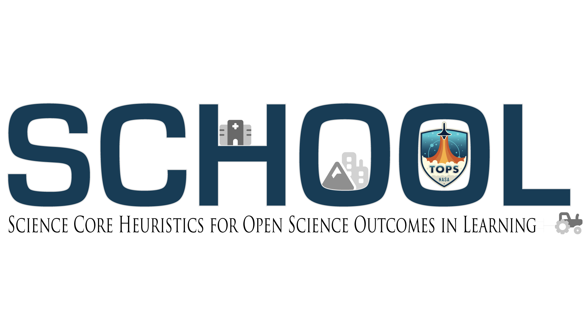

.. Author: Akshay Mestry <xa@mes3.dev>
.. Created on: Monday, October 28, 2024
.. Last updated on: Friday, November 01, 2024

:orphan:

.. _home-page:

===============================================================================
Science Core Heuristics for Open Science Outcomes in Learning
===============================================================================

.. title-hero::
    :icon: fa-solid fa-telescope
    :summary:
        Part of the NASA Transform to Open Science (TOPS) Training initiative.

.. tags:: open-science-101

.. contributors::
    :location: Palisades, NY
    :timestamp: September 06, 2024

    - :name: TOPSTSCHOOL Development Team
    - :email: TOPSTSCHOOL@gmail.com
    - :headshot: https://avatars.githubusercontent.com/u/16084170?s=200&v=4
    - :github: https://github.com/ciesin-geospatial
    - :youtube: https://www.youtube.com/@TOPSTSCHOOL

-------------------------------------------------------------------------------
Site Under Construction...
-------------------------------------------------------------------------------

**Science Core Heuristics for Open Science Outcomes in Learning**
(:term:`SCHOOL`) is part of the |website-tops| Training initiative, designed
to generate an inclusive culture of open science. The :term:`SCHOOL`
curriculum consists of five 2.5-hour open, interactive, and interdisciplinary
learning modules covering an array of lessons across the thematic areas of
**water**, **health** and **air quality**, **environmental justice**,
**natural disasters**, **climate**, **agriculture**, and **wildfires**,
integrating themes of population and infrastructure across the modules. Within
the modules, lessons in Earth Science Applications use cases demonstrate how
to access and analyze data sources in open data science lifecycle workflows
focusing on :term:`FAIR` principles for scientific data management.

Project announcements: `TOPSTSCHOOL <https://ciesin-geospatial.github.io/TOPSTSCHOOL/>`_.

Learn about our recent work: `Blog Posts <https://ciesin-geospatial.github.io/TOPSTSCHOOL/about.html#blog>`_ • `Presentations <https://ciesin-geospatial.github.io/TOPSTSCHOOL/about.html#slides>`_ • `SEDAC <https://sedac.ciesin.columbia.edu/>`_ • `CIESIN <https://www.ciesin.columbia.edu/index.html>`_ • `iSciences <https://www.isciences.com/>`_ • `Baruch College <https://www.baruch.cuny.edu/>`_

.. toctree::
    :caption: Tutorials & Guides
    :hidden:
    :titlesonly:

    _documentation/_tutorials/_001-basics/open-science-101
